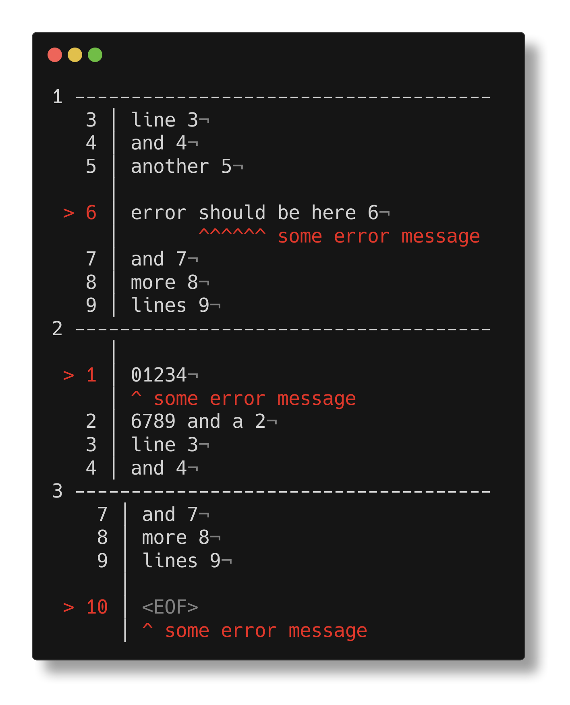

<h1 align="center">annotate-code</h1>

<p align="center">
beautifully annotate source code with a message, given an index, like a parser or compiler
</p>

<p align="center">
   <a href="#install">        🔧 <strong>Install</strong></a>
 · <a href="#example">        🧩 <strong>Example</strong></a>
 · <a href="#api">            📜 <strong>API docs</strong></a>
 · <a href="https://github.com/stagas/annotate-code/releases"> 🔥 <strong>Releases</strong></a>
 · <a href="#contribute">     💪🏼 <strong>Contribute</strong></a>
 · <a href="https://github.com/stagas/annotate-code/issues">   🖐️ <strong>Help</strong></a>
</p>

***

## Install

```sh
$ npm i annotate-code
```

## Example

```ts
import { annotate } from 'annotate-code'

console.log(
  annotate({
    message: 'some error message',
    index: 48,
    size: 6,
    input,
  }).message
)
```



## API

<!-- Generated by documentation.js. Update this documentation by updating the source code. -->

#### Table of Contents

*   [annotate](#annotate)
    *   [Parameters](#parameters)

### annotate

[src/index.ts:44-160](https://github.com/stagas/annotate-code/blob/8529e7aa89cf4b8d3f63e8b3069fb0252b3d55ac/src/index.ts#L44-L160 "Source code on GitHub")

Annotates a source code string given an index and a message.

#### Parameters

*   `settings` **{message: [string](https://developer.mozilla.org/docs/Web/JavaScript/Reference/Global_Objects/String), input: [string](https://developer.mozilla.org/docs/Web/JavaScript/Reference/Global_Objects/String), index: [number](https://developer.mozilla.org/docs/Web/JavaScript/Reference/Global_Objects/Number), linesBefore: [number](https://developer.mozilla.org/docs/Web/JavaScript/Reference/Global_Objects/Number)?, linesAfter: [number](https://developer.mozilla.org/docs/Web/JavaScript/Reference/Global_Objects/Number)?, size: [number](https://developer.mozilla.org/docs/Web/JavaScript/Reference/Global_Objects/Number)?, showLineNumbers: [boolean](https://developer.mozilla.org/docs/Web/JavaScript/Reference/Global_Objects/Boolean)?}**&#x20;

    *   `settings.message`  The message to display
    *   `settings.input`  The code to annotate
    *   `settings.index`  The index position
    *   `settings.linesBefore`  How many lines before to show (optional, default `3`)
    *   `settings.linesAfter`  How many lines after to show (optional, default `3`)
    *   `settings.size`  The size of the arrows ^^^^ (optional, default `1`)
    *   `settings.showLineNumbers`  Whether to show line numbers (optional, default `true`)

Returns **{line: [number](https://developer.mozilla.org/docs/Web/JavaScript/Reference/Global_Objects/Number)?, col: [number](https://developer.mozilla.org/docs/Web/JavaScript/Reference/Global_Objects/Number)?, message: [string](https://developer.mozilla.org/docs/Web/JavaScript/Reference/Global_Objects/String)}**&#x20;

## Contribute

[Fork](https://github.com/stagas/annotate-code/fork) or
[edit](https://github.dev/stagas/annotate-code) and submit a PR.

All contributions are welcome!

## License

MIT © 2021
[stagas](https://github.com/stagas)
